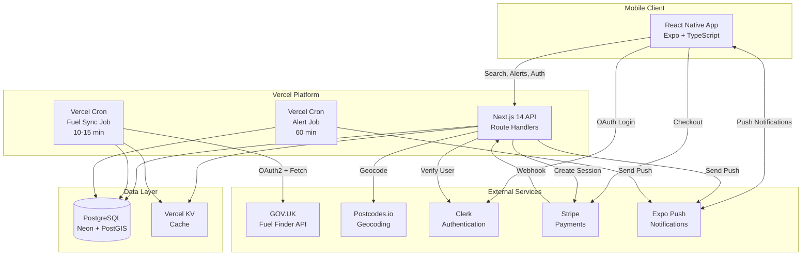

# Design Document: FuelFuse MVP

## Overview

FuelFuse is a mobile-first fuel price comparison application built with React Native (Expo) for the frontend and Next.js 14 for the backend API. The system architecture follows a clear separation between data ingestion, API services, and mobile client, with all fuel price data sourced from the GOV.UK Fuel Finder API and stored in PostgreSQL.

The core design principle is that the mobile app never directly queries external APIs. Instead, scheduled ingestion jobs populate a PostgreSQL database, and all user searches query this local data store. This approach ensures fast response times, predictable costs, and resilience against external API failures.

## Architecture

### High-Level Architecture



### Technology Stack

**Mobile Application:**
- React Native with Expo (TypeScript)
- Expo Router for navigation
- expo-notifications for push notifications
- expo-web-browser for Stripe checkout
- Clerk Expo SDK for authentication
- Axios for API requests

**Backend API:**
- Next.js 14 App Router (TypeScript)
- Prisma ORM for database access
- Zod for validation
- Vercel deployment

**Database:**
- PostgreSQL (Neon recommended)
- PostGIS extension for geospatial queries
- Prisma migrations

**Jobs:**
- Vercel Cron for scheduled tasks
- OAuth2 client for Fuel Finder API
- Expo Push API for notifications

**External Services:**
- Clerk for authentication
- Stripe Checkout for payments
- Expo Push Service for notifications
- postcodes.io for geocoding

## Components and Interfaces

### Mobile App Components

#### 1. Authentication Module
- **Clerk Integration**: Handles user sign-up, login, and session management
- **Token Management**: Stores and refreshes Clerk JWT tokens
- **Protected Routes**: Wraps authenticated screens with auth guards

#### 2. Search Module
- **Search Screen**: Input for postcode or location, radius selector, fuel type picker
- **Location Service**: Requests device location permissions and retrieves coordinates
- **Results List**: Displays cheapest stations with price, distance, last updated
- **Station Detail**: Shows full station information including amenities

#### 3. Alerts Module (Pro Only)
- **Alert Rules List**: Displays user's configured alert rules
- **Create Alert Form**: Allows users to set location, radius, fuel type, threshold
- **Push Token Registration**: Registers Expo push token on app launch

#### 4. Account Module
- **Preferences Screen**: Saves home postcode, default radius, default fuel type
- **Subscription Status**: Displays current tier (Free/Pro)
- **Upgrade Button**: Opens Stripe Checkout in in-app browser

### Backend API Components

#### 1. Search Service
```typescript
interface SearchService {
  searchByPostcode(params: {
    postcode: string;
    radiusMiles: number;
    fuelType: 'petrol' | 'diesel';
  }): Promise<StationResult[]>;
  
  searchByCoordinates(params: {
    lat: number;
    lng: number;
    radiusMiles: number;
    fuelType: 'petrol' | 'diesel';
  }): Promise<StationResult[]>;
  
  getStationDetail(stationId: string): Promise<StationDetail>;
}

interface StationResult {
  stationId: string;
  brand: string;
  name: string;
  address: string;
  postcode: string;
  pricePerLitre: number;
  distanceMiles: number;
  lastUpdated: Date;
}

interface StationDetail extends StationResult {
  lat: number;
  lng: number;
  petrolPrice: number | null;
  dieselPrice: number | null;
  amenities: Record<string, any> | null;
  openingHours: Record<string, any> | null;
}
```

#### 2. Geocoding Service
```typescript
interface GeocodingService {
  normalizePostcode(postcode: string): string;
  geocodePostcode(postcode: string): Promise<Coordinates>;
  getCachedCoordinates(normalizedPostcode: string): Promise<Coordinates | null>;
  cacheCoordinates(normalizedPostcode: string, coords: Coordinates): Promise<void>;
}

interface Coordinates {
  lat: number;
  lng: number;
}
```

#### 3. Ingestion Service
```typescript
interface IngestionService {
  runFuelSync(): Promise<IngestionResult>;
  authenticateOAuth(): Promise<string>;
  fetchStationsFromAPI(token: string): Promise<FuelFinderStation[]>;
  upsertStations(stations: FuelFinderStation[]): Promise<void>;
  recordIngestionRun(result: IngestionResult): Promise<void>;
}

interface IngestionResult {
  status: 'success' | 'partial' | 'failed';
  stationsProcessed: number;
  pricesUpdated: number;
  errors: string[];
  startedAt: Date;
  finishedAt: Date;
}

interface FuelFinderStation {
  stationId: string;
  brand: string;
  name: string;
  address: string;
  postcode: string;
  lat: number;
  lng: number;
  petrolPrice: number | null;
  dieselPrice: number | null;
  updatedAt: Date;
  amenities?: Record<string, any>;
  openingHours?: Record<string, any>;
}
```

#### 4. Alert Service
```typescript
interface AlertService {
  runAlertJob(): Promise<AlertJobResult>;
  evaluateAlertRule(rule: AlertRule): Promise<AlertEvaluation>;
  sendPushNotification(token: string, alert: AlertNotification): Promise<void>;
  updateAlertTrigger(ruleId: string, price: number): Promise<void>;
}

interface AlertRule {
  id: string;
  userId: string;
  centerPostcode?: string;
  lat?: number;
  lng?: number;
  radiusMiles: number;
  fuelType: 'petrol' | 'diesel';
  triggerType: 'price_drop';
  thresholdPpl: number;
  enabled: boolean;
  lastTriggeredAt?: Date;
  lastNotifiedPrice?: number;
}

interface AlertEvaluation {
  shouldTrigger: boolean;
  currentPrice?: number;
  priceDrop?: number;
  station?: StationResult;
}

interface AlertNotification {
  title: string;
  body: string;
  data: {
    stationId: string;
    newPrice: number;
    priceDrop: number;
  };
}

interface AlertJobResult {
  status: 'success' | 'failed';
  alertsEvaluated: number;
  notificationsSent: number;
  errors: string[];
  startedAt: Date;
  finishedAt: Date;
}
```

#### 5. Subscription Service
```typescript
interface SubscriptionService {
  createCheckoutSession(userId: string, priceId: string): Promise<CheckoutSession>;
  handleWebhook(event: StripeEvent): Promise<void>;
  getSubscriptionStatus(userId: string): Promise<SubscriptionStatus>;
  isProUser(userId: string): Promise<boolean>;
}

interface CheckoutSession {
  sessionId: string;
  url: string;
}

interface SubscriptionStatus {
  tier: 'free' | 'pro';
  status?: string;
  periodEnd?: Date;
}
```

#### 6. Push Token Service
```typescript
interface PushTokenService {
  registerToken(userId: string, token: string, platform: 'ios' | 'android'): Promise<void>;
  getTokensForUser(userId: string): Promise<string[]>;
  removeToken(token: string): Promise<void>;
}
```

## Data Models

### Prisma Schema

```prisma
// User and Authentication
model User {
  id              String            @id @default(cuid())
  clerkUserId     String            @unique
  email           String
  createdAt       DateTime          @default(now())
  updatedAt       DateTime          @updatedAt
  
  subscription    Subscription?
  preferences     UserPreferences?
  pushTokens      PushToken[]
  alertRules      AlertRule[]
}

model Subscription {
  id                String    @id @default(cuid())
  userId            String    @unique
  user              User      @relation(fields: [userId], references: [id], onDelete: Cascade)
  
  stripeCustomerId  String    @unique
  stripeSubscriptionId String? @unique
  status            String    // active, canceled, past_due, etc.
  plan              String    // free, pro_monthly, pro_yearly
  periodEnd         DateTime?
  
  createdAt         DateTime  @default(now())
  updatedAt         DateTime  @updatedAt
  
  @@index([userId])
}

model UserPreferences {
  id              String   @id @default(cuid())
  userId          String   @unique
  user            User     @relation(fields: [userId], references: [id], onDelete: Cascade)
  
  homePostcode    String?
  defaultRadius   Int      @default(5)
  defaultFuelType String   @default("petrol") // petrol, diesel
  
  createdAt       DateTime @default(now())
  updatedAt       DateTime @updatedAt
}

// Push Notifications
model PushToken {
  id            String   @id @default(cuid())
  userId        String
  user          User     @relation(fields: [userId], references: [id], onDelete: Cascade)
  
  expoPushToken String   @unique
  platform      String   // ios, android
  
  createdAt     DateTime @default(now())
  updatedAt     DateTime @updatedAt
  
  @@index([userId])
  @@index([expoPushToken])
}

model AlertRule {
  id                  String    @id @default(cuid())
  userId              String
  user                User      @relation(fields: [userId], references: [id], onDelete: Cascade)
  
  centerPostcode      String?
  lat                 Float?
  lng                 Float?
  radiusMiles         Int
  fuelType            String    // petrol, diesel
  triggerType         String    @default("price_drop")
  thresholdPpl        Int       @default(2)
  enabled             Boolean   @default(true)
  
  lastTriggeredAt     DateTime?
  lastNotifiedPrice   Int?
  
  createdAt           DateTime  @default(now())
  updatedAt           DateTime  @updatedAt
  
  @@index([userId, enabled])
}

// Fuel Stations and Prices
model Station {
  id                String   @id @default(cuid())
  stationId         String   @unique // Source station ID from Fuel Finder
  
  brand             String
  name              String
  address           String
  postcode          String
  lat               Float
  lng               Float
  
  amenities         Json?
  openingHours      Json?
  
  updatedAtSource   DateTime
  createdAt         DateTime @default(now())
  updatedAt         DateTime @updatedAt
  
  latestPrice       StationPriceLatest?
  priceHistory      StationPriceHistory[]
  
  @@index([lat, lng])
  @@index([postcode])
}

model StationPriceLatest {
  id                String   @id @default(cuid())
  stationId         String   @unique
  station           Station  @relation(fields: [stationId], references: [id], onDelete: Cascade)
  
  petrolPpl         Int?     // Price in pence per litre
  dieselPpl         Int?
  
  updatedAtSource   DateTime
  fetchedAt         DateTime @default(now())
  
  @@index([updatedAtSource])
}

model StationPriceHistory {
  id                String   @id @default(cuid())
  stationId         String
  station           Station  @relation(fields: [stationId], references: [id], onDelete: Cascade)
  
  petrolPpl         Int?
  dieselPpl         Int?
  
  updatedAtSource   DateTime
  fetchedAt         DateTime @default(now())
  
  @@unique([stationId, updatedAtSource])
  @@index([stationId, updatedAtSource])
}

// Geocoding Cache
model PostcodeGeoCache {
  id                  String   @id @default(cuid())
  postcodeNormalized  String   @unique
  
  lat                 Float
  lng                 Float
  
  createdAt           DateTime @default(now())
  lastUsedAt          DateTime @default(now())
  
  @@index([postcodeNormalized])
}

// Job Tracking
model IngestionRun {
  id              String   @id @default(cuid())
  
  startedAt       DateTime
  finishedAt      DateTime?
  status          String   // success, partial, failed
  counts          Json     // { stationsProcessed, pricesUpdated, errors }
  errorSummary    Json?
  
  @@index([startedAt])
}

model AlertRun {
  id              String   @id @default(cuid())
  
  startedAt       DateTime
  finishedAt      DateTime?
  status          String   // success, failed
  sentCount       Int      @default(0)
  errorSummary    Json?
  
  @@index([startedAt])
}
```

## Correctness Properties


A property is a characteristic or behavior that should hold true across all valid executions of a system—essentially, a formal statement about what the system should do. Properties serve as the bridge between human-readable specifications and machine-verifiable correctness guarantees.

### Search and Geospatial Properties

**Property 1: Search results are within radius and sorted by price**
*For any* valid search parameters (postcode or coordinates, radius, fuel type), all returned stations should be within the specified radius, sorted by price ascending, and contain all required fields (name, brand, price, distance, last updated).
**Validates: Requirements 1.1, 1.2, 1.3, 1.7**

**Property 2: Station detail contains all required fields**
*For any* valid station ID, the returned station detail should contain station name, brand, address, postcode, petrol price, diesel price, last updated timestamp, and amenities/opening hours (or null if unavailable).
**Validates: Requirements 2.1, 2.2**

### Postcode and Geocoding Properties

**Property 3: Postcode normalization is consistent**
*For any* postcode string (regardless of case or spacing), normalization should produce uppercase with standard spacing format.
**Validates: Requirements 1.5, 14.1**

**Property 4: Geocoding cache round-trip**
*For any* postcode, if geocoding succeeds and is cached, then subsequent lookups should return the same coordinates without external API calls, and last_used_at should be updated.
**Validates: Requirements 1.6, 14.2, 14.3, 14.4, 14.5**

### User Account and Preferences Properties

**Property 5: User creation stores Clerk ID and email**
*For any* valid user signup with Clerk user ID and email, a user record should be created in the database with those values.
**Validates: Requirements 3.1**

**Property 6: User preferences round-trip**
*For any* valid user preferences (home postcode, default radius, default fuel type), saving then retrieving should return equivalent values.
**Validates: Requirements 3.2, 3.3**

**Property 7: Invalid inputs are rejected**
*For any* invalid input to any API endpoint, the request should be rejected with appropriate error before database operations.
**Validates: Requirements 3.4, 6.4, 8.1**

### Push Notification and Alert Properties

**Property 8: Push token registration stores token and platform**
*For any* valid Expo push token and platform, registration should store the token associated with the user ID.
**Validates: Requirements 4.1**

**Property 9: Alert rule creation stores all parameters**
*For any* valid alert rule parameters (location, radius, fuel type, trigger type, threshold), creation should store all values correctly.
**Validates: Requirements 4.2**

**Property 10: Alert evaluation identifies price drops meeting threshold**
*For any* enabled alert rule and current price data, if the price drop meets or exceeds the threshold and last trigger was >24 hours ago, the alert should trigger.
**Validates: Requirements 4.3**

**Property 11: Alert notifications contain required information**
*For any* triggered alert, the push notification should contain station name, new price, and price drop amount.
**Validates: Requirements 4.4**

**Property 12: Alert rate limiting prevents spam**
*For any* user, no more than 2 alerts should be sent per 24-hour period, and alerts should not re-trigger within 24 hours of last trigger.
**Validates: Requirements 4.5, 4.6**

**Property 13: Disabled alerts are not evaluated**
*For any* alert rule with enabled=false, the alert job should skip evaluation and not send notifications.
**Validates: Requirements 4.7**

### Subscription and Payment Properties

**Property 14: Checkout session creation returns valid URL**
*For any* Free tier user requesting upgrade, a Stripe checkout session should be created with a valid session ID and URL.
**Validates: Requirements 5.1**

**Property 15: Webhook updates subscription status**
*For any* valid Stripe webhook event for subscription completion, the user's subscription status should be updated to Pro tier in the database.
**Validates: Requirements 5.2**

**Property 16: Webhook processing is idempotent**
*For any* Stripe webhook event, processing the same event ID multiple times should produce the same database state as processing it once.
**Validates: Requirements 5.3, 8.4**

**Property 17: Subscription tier authorization**
*For any* user, Pro features should be accessible if and only if the user has an active Pro subscription in the database; Free tier users should be blocked from Pro features and limited to 5-mile radius.
**Validates: Requirements 5.4, 5.5, 5.6, 5.7**

### Data Ingestion Properties

**Property 18: OAuth token caching reduces API calls**
*For any* OAuth token with expiry time, the token should be reused for subsequent requests until 5 minutes before expiry, then refreshed.
**Validates: Requirements 6.2**

**Property 19: Station upsert creates or updates by station ID**
*For any* station data from Fuel Finder API, if the station_id exists, the record should be updated; if not, a new record should be created.
**Validates: Requirements 6.5**

**Property 20: Price history prevents duplicates**
*For any* station price with station_id and updated_at_source, inserting the same combination multiple times should result in only one record in station_prices_history.
**Validates: Requirements 6.6, 11.6**

**Property 21: Ingestion run metadata is recorded**
*For any* ingestion job execution, an ingestion_runs record should be created with start time, end time, status, counts, and error summary.
**Validates: Requirements 6.7**

**Property 22: Ingestion is idempotent**
*For any* Fuel Finder API payload, processing the same payload multiple times should produce the same database state (no duplicate stations or prices) as processing it once.
**Validates: Requirements 6.8**

**Property 23: Cron endpoints require authentication**
*For any* request to cron endpoints without correct x-cron-secret header, the request should be rejected with 401/403 error.
**Validates: Requirements 6.11, 8.5**

### CSV Fallback Properties

**Property 24: CSV and API ingestion produce equivalent results**
*For any* station and price data, ingesting via CSV fallback should produce the same database state as ingesting via API (same upsert logic).
**Validates: Requirements 7.2**

**Property 25: CSV fallback requires admin authorization**
*For any* request to CSV fallback endpoint from non-admin user, the request should be rejected.
**Validates: Requirements 7.3**

### Security Properties

**Property 26: Webhook signature verification**
*For any* Stripe webhook event with invalid signature, the request should be rejected before processing.
**Validates: Requirements 8.3**

## Error Handling

### Error Categories

1. **Validation Errors (4xx)**
   - Invalid postcode format
   - Invalid coordinates (out of bounds)
   - Invalid radius (negative or exceeds tier limit)
   - Invalid fuel type (not petrol/diesel)
   - Missing required fields
   - Response: 400 Bad Request with Zod error details

2. **Authentication Errors (401/403)**
   - Missing or invalid Clerk token
   - Missing or invalid cron secret
   - Invalid Stripe webhook signature
   - Response: 401 Unauthorized or 403 Forbidden

3. **Authorization Errors (403)**
   - Free tier user accessing Pro features
   - Free tier user exceeding radius limit
   - Non-admin accessing admin endpoints
   - Response: 403 Forbidden with upgrade message

4. **Not Found Errors (404)**
   - Station ID not found
   - User preferences not found
   - Alert rule not found
   - Response: 404 Not Found

5. **Rate Limiting Errors (429)**
   - Too many search requests
   - Too many API calls to external services
   - Response: 429 Too Many Requests with retry-after header

6. **External Service Errors (502/503)**
   - Fuel Finder API unavailable
   - Postcodes.io unavailable
   - Stripe API unavailable
   - Expo Push Service unavailable
   - Response: 502 Bad Gateway or 503 Service Unavailable

7. **Database Errors (500)**
   - Connection failures
   - Transaction failures
   - Constraint violations
   - Response: 500 Internal Server Error (logged to Sentry)

### Error Handling Strategy

**Retry Logic:**
- External API calls: 3 retries with exponential backoff (1s, 2s, 4s)
- Database operations: 2 retries with 500ms delay
- Fuel Finder API 429: Exponential backoff up to 60s

**Timeout Configuration:**
- External API calls: 10s timeout
- Database queries: 5s timeout
- Webhook processing: 15s timeout

**Graceful Degradation:**
- If PostGIS unavailable, fall back to Haversine formula
- If geocoding fails, return error but don't crash
- If push notification fails, log error but continue alert job

**Error Logging:**
- All errors logged to Sentry with context (user ID, request ID, stack trace)
- Structured logs include: timestamp, level, service, operation, error details
- PII (email, postcode) redacted from logs

## Testing Strategy

### Unit Testing

Unit tests verify specific examples, edge cases, and error conditions for individual functions and modules.

**Backend Unit Tests:**
- Postcode normalization with various formats (lowercase, extra spaces, no spaces)
- Distance calculation (Haversine formula) with known coordinates
- Radius filtering with edge cases (exactly on boundary, just outside)
- Price sorting with ties (same price, different distances)
- Zod schema validation with invalid inputs
- OAuth token expiry calculation
- Alert threshold evaluation logic
- Subscription tier checking

**Mobile Unit Tests:**
- Component rendering with various props
- Navigation logic
- Form validation
- Data transformation utilities

### Property-Based Testing

Property-based tests verify universal properties across many randomly generated inputs (minimum 100 iterations per test).

**Property Test Configuration:**
- Library: fast-check (TypeScript/JavaScript)
- Iterations: 100 minimum per property
- Seed: Configurable for reproducibility
- Shrinking: Enabled to find minimal failing cases

**Backend Property Tests:**
Each property from the Correctness Properties section should be implemented as a property-based test:

- **Property 1**: Generate random search parameters, verify results within radius and sorted
- **Property 3**: Generate random postcode strings, verify normalization consistency
- **Property 6**: Generate random preferences, verify round-trip equality
- **Property 7**: Generate invalid inputs, verify rejection
- **Property 16**: Generate webhook events, verify idempotency
- **Property 17**: Generate user tiers, verify authorization rules
- **Property 20**: Generate duplicate price records, verify deduplication
- **Property 22**: Generate API payloads, verify ingestion idempotency

**Test Data Generators:**
- Postcode generator: Valid UK postcode formats with random variations
- Coordinates generator: Valid UK lat/lng within bounds
- Station generator: Random stations with required fields
- Price generator: Realistic prices (100-200 ppl)
- User generator: Random Clerk IDs and emails
- Alert rule generator: Valid alert configurations

### Integration Testing

Integration tests verify end-to-end flows across multiple components.

**Critical Integration Tests:**
1. **Fuel Sync Idempotency**: Run ingestion twice with same payload, verify no duplicates
2. **Search Flow**: Create stations → search by postcode → verify correct results
3. **Alert Flow**: Create alert rule → update prices → run alert job → verify notification sent
4. **Subscription Flow**: Create checkout → webhook → verify Pro access granted
5. **Geocoding Cache**: Search by postcode → verify cache created → search again → verify cache hit

### Mobile Testing

**Component Tests:**
- Search screen renders correctly
- Results list displays stations
- Station detail shows all information
- Alert form validates inputs

**Integration Tests:**
- Push token registration flow (mocked API)
- Search flow (mocked API)
- Stripe checkout opens browser
- Navigation between screens

### Test Environment

**Database:**
- Use test database with migrations applied
- Seed with minimal test data
- Clean database between tests

**External Services:**
- Mock Fuel Finder API responses
- Mock Stripe webhook events
- Mock Expo Push Service
- Mock postcodes.io responses

**CI/CD:**
- Run all tests on every PR
- Require 100% test pass rate
- Generate coverage reports (target: >80%)
- Run property tests with fixed seed for consistency

### Test Tagging

Each property-based test must include a comment tag referencing the design property:

```typescript
// Feature: fuelfuse-mvp, Property 1: Search results are within radius and sorted by price
test('search returns stations within radius sorted by price', async () => {
  await fc.assert(
    fc.asyncProperty(
      searchParamsArbitrary(),
      async (params) => {
        const results = await searchService.search(params);
        // Verify all results within radius
        // Verify sorted by price ascending
      }
    ),
    { numRuns: 100 }
  );
});
```
